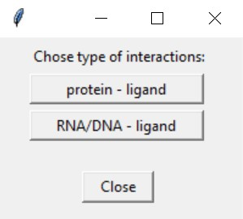
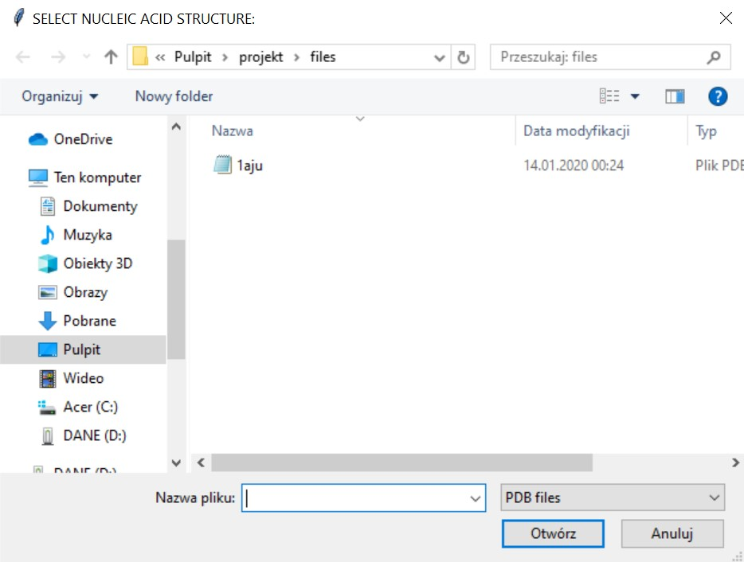
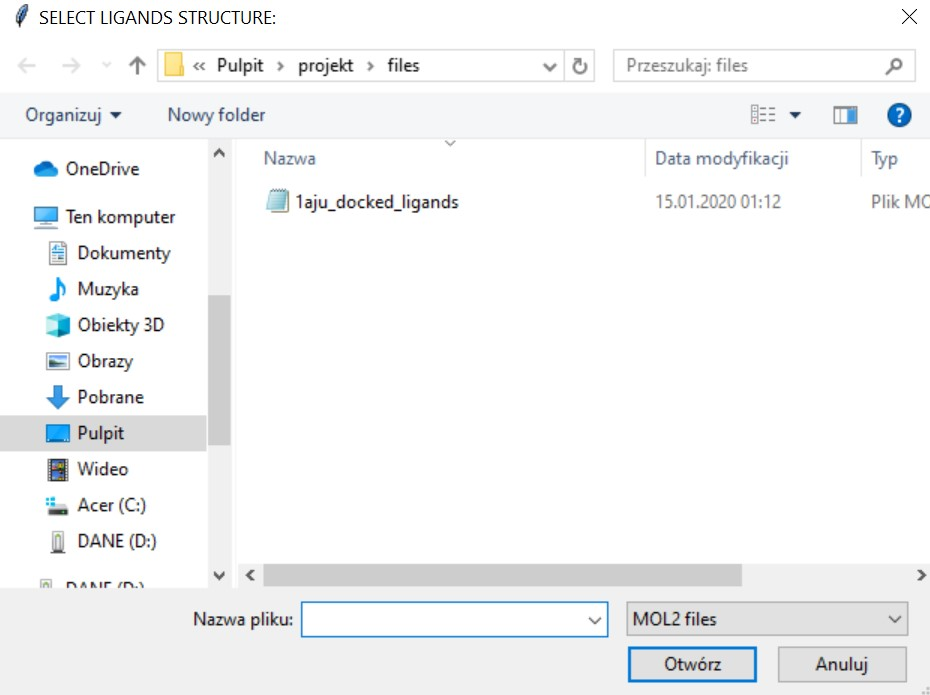
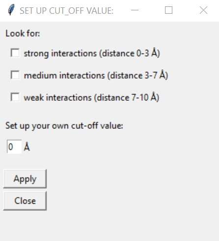

#Szukanie interakcji target-ligand

Obecnie proces szukania nowych terapeutyków często rozpoczyna się od analizy
bioinformatycznej. Metody komputerowe pozwalają w łatwy i szybki sposób
przewidywać struktury makromolekuł, a także ich interakcje z innymi cząsteczkami (np. lekami).

Pierwszym etapem projektowania leków jest często screening wirtualny. Bazy cząsteczek *(ligandów)* o potencjalnej
aktywności biologicznej są dokowane *(dopasowywane, umieszczane)* w miejscu aktywnym targetów molekularnych 
*(najczęsciej białek bądź kwasów nukleinowych)*. Programy komputerowe dopasowują do siebie struktury
tak, aby było to jak najbardzie korzystne energetycznie. Następnie każda sprawdzona cząsteczka otrzymuje *score*,
który określa jak dobrze pasuje ona do targetu. Zakłada się, że cząsteczki z najlepszym
scorem mają największą szansę wykazać akywności biologiczną i tylko je uwzględnia się w dalszych
badaniach.
---
Powyższy program służy do odnajdywania interakcji obecnych między białkiem lub kwasem nukleinowym
(DNA/RNA) a ligandami zadokowanymi w jego strukturze. Program dla uproszczenia trakuje takie interakcje jako
występowanie atomów targetu w określonej odległości od atomów liganda. W zależności od wyboru użytkownika,
program może znajdywać silne, średnie lub słabe odzdziaływania, a także pozwala na manualne wybranie
obszaru, w obrębie którego taka analiza zostanie wykonana *(Tabela 1)*.

*Tabela 1*

| Odległość      | Rodzaj interakcji    |
| :------------: | :------------------: |
| 0 - 3 Å        | silna                |
| 3 - 7 Å        | średnia              |
| 7 - 10 Å       | słaba                |

Ostatecznie program wypisuje wszystkie występujące interakcje target-ligand dla wybranej odległości, a także oblicza ile
takich interakcji występuje dla każdego z ligandów i wybiera ligand (bądź ligandy) o największej ich liczbie.
Można założyć, że ligandy o największej liczbie interakcji to te o największej aktywności.

Podsumowując program pozwala w łatwy sposób wybrać najaktywniejszy ligand z badanej grupy ligandów.

---

**Dane wejściowe:**
1. struktura białka/kwasu nukleinowego w formacie PDB
2. struktura ligandów w formacie MOL2 *
3. odległość, dla której urzytkownik chce przeprowadzić analizę

**UWAGA!** * plik ze strukturą ligandów powinien być plikiem otrzymanym w procesie dokowania molekularnego, a
nie dowolnym plikiem MOL2 (program uruchomi się, jednak analiza nie będzie miała sensu, gdyż dopiero po procesie
dokowania ligandy występują w odpowiedniej pozycji w stosunku do targetu i otrzymane wyniki są odzwierciedleniem
rzeczywistości)

**Dane wyjściowe:**
1. wyprintowane odnalezione przez program interakcje oraz wybrany najaktywniejszy ligand (bądź ligandy)
2. plik csv opisujący, które aminokwasy białka (bądź nukleotydy DNA/RNA) oddziałują z poszczególnymi ligandami
3. plik csv z posortowanymi według ilości interakcji ligandami 

Program analizuje plik ze strukturą targetu oraz ligandów i na podstawie zawartych w nich współrzędnych atomów
oblicza odległości pomiędzy każdym atomem z targetu a każdym atomem każdego z ligandów. Następnie pozostawia
tylko te rekordy, dla których odległość mieści się w wybranym przez użytkownika zakresie oraz zlicza z jaką
liczbą aminokwasów/nukleotydów kontaktuje się każda z cząsteczek.

---
**Uruchomienie programu:**

W celu uruchomienia programu należy najpierw zainstalować wszystkie pakiety wyszczególnione w pliku
 *requirements.txt*.
 
    pip install -r requirements.txt
    
Natępnie w folderze *program* w terminalu należy wywołać program komendą:

    python main.py

---
**Obsługa GUI:**

Program posiada prosty w obsłudze interfejs graficzny.

W celu wykonania analizy należy:
1. wybrać jaki rodzaj interakcji użytkownik chce badać (interakcje ligandów z białkiem czy z DNA/RNA)

   

2. Wybrać plik ze strukturą targetu (na zdjęciu dla opcji DNA/RNA)

   
   
3. Wybrać plik ze strukturą ligandów

   
   
4. Wybrać odległość, dla jakiej będzie wykonana analiza

   
   
   Użytkownik ma pełną dowolność jeżeli chodzi o wybór odległości. Można wybrać 1, 2 lub 3 dostępne opcje,
   a także wpisać własną wartość. *(W przypadku wpisania własnej wartości to ona będzie brana pod uwagę, nawet
   jeśli któreś z okienek jest zaznaczone.)*

**W rezultacie program printuje listę interakcji oraz najaktywniejszy ligand (bądź ligandy) oraz tworzy folder *results*,
w którym zapisuje końcowe pliki csv.**   

